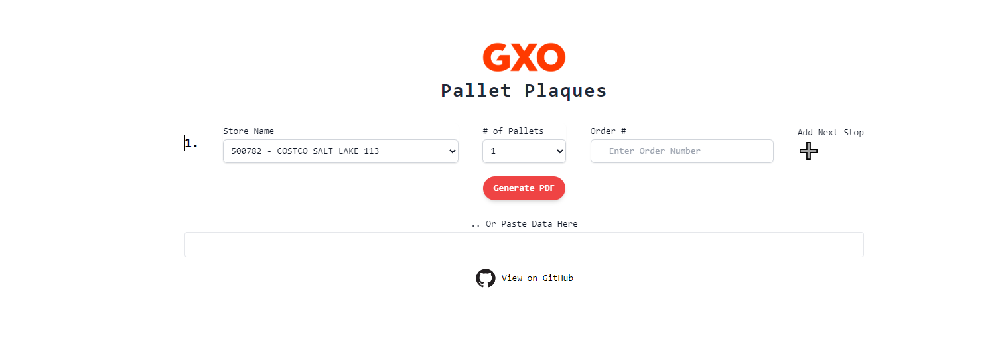
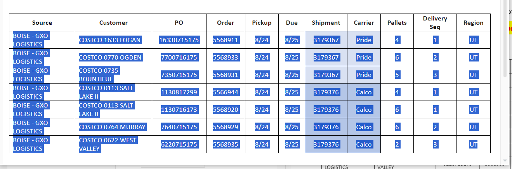
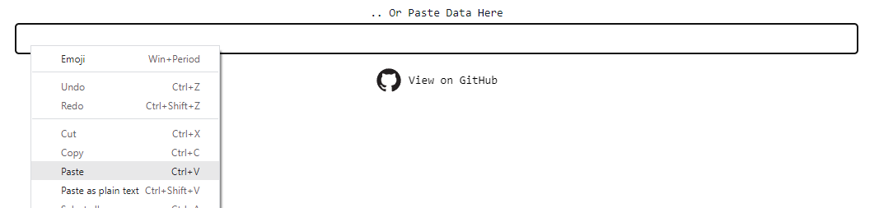
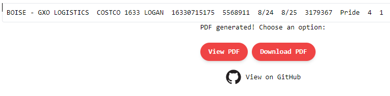
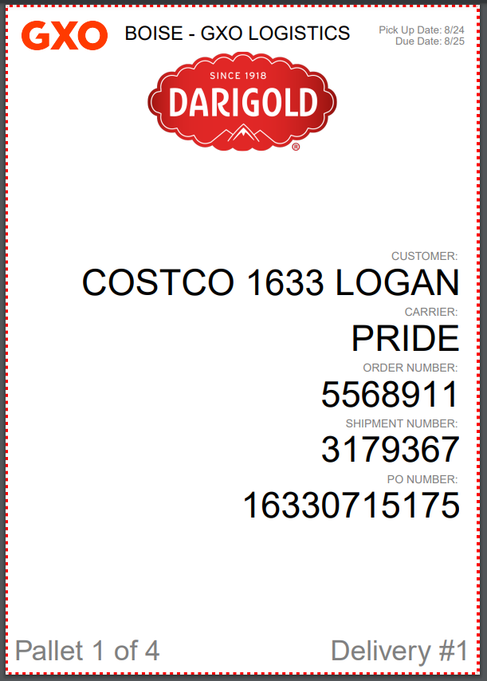
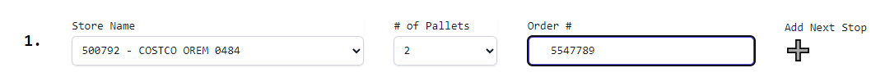
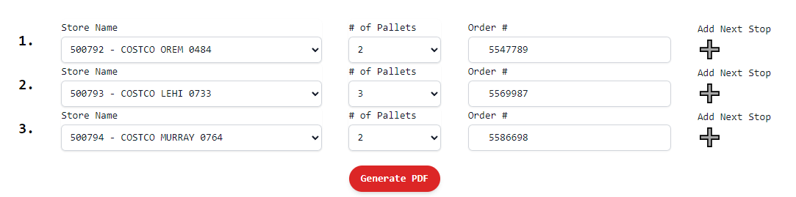
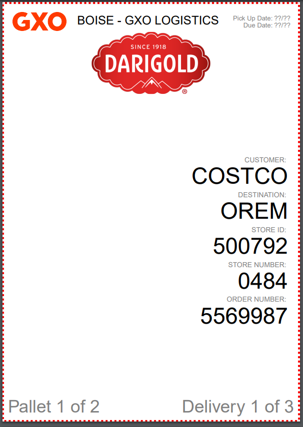

# Related Projects

This project is a continuation of the original repo, which was scrapped:
https://github.com/infiniteoo/pallet_plaques

Here is the backend server repo used to handle the PDF generation requests:
https://github.com/infiniteoo/pp_backend

INTRODUCING..

 

 🥁🥁🥁🥁

drumroll please​

 🥁🥁🥁🥁

 

# Pallet Plaques - Automatic Pallet Tag Generator

 

https://www.palletplaques.com

## Try it Yourself
* clone the repo and download it locally
* npm install in the project directory
* npm run start
* download the backend repo
* npm install in that project directory
* npm run start
* front end client runs on at localhost:3000, server at localhost:8122

Written entirely by me in the React and Node.js frameworks, this app quickly and easily generates high quality, professional pallet tags at the drop of a button:

<!-- 1 -->
[]
If you copy and paste the data ...

<!-- 2 -->
 ]

... into the "Paste Data Here" field:

 
<!-- 3 -->
]

 

 

a few seconds later, "view pdf" and "download pdf" buttons appear:

 

<!-- 4 -->
]
 

 

click "view pdf" and see the awesome tags that are generated:

 <!-- 5 -->
]

 

at that point, you are ready to send that entire batch of automatically generated pallet tags to the printer.

 

If we are able to receive our Costco datapoints exactly how Patrick sent them yesterday, all you have to do is copy and paste, and my app takes care of the rest. 

 

Try it for yourself, go to palletplaques.com and enter the data.  Patrick's email is attached to this one for quick access to his provided spreadsheet cells.

 

That's not all!

 

There is also a more manually intensive method to generating pallet tags.

 

From the dropdown box on the web site, you'll see all of our Costco's we deliver to.  Select one, then select a random pallet amount for that stop, and finally, enter a fake order number.  Hit the big plus icon on the right to create another stop.

 
<!-- 6 -->

]
 

Do this a few more times then select "Generate PDF":

 

<!-- 7 -->
]
 

a few seconds later, the same "view" and "download" buttons appear, generating pallet tags.  

 
<!-- 8 -->

]
 

 

 

Unfortunately, the data these pallet tags provide is limited by whatever the user enters on the website.  The more data to enter, the more cumbersome the process becomes.

